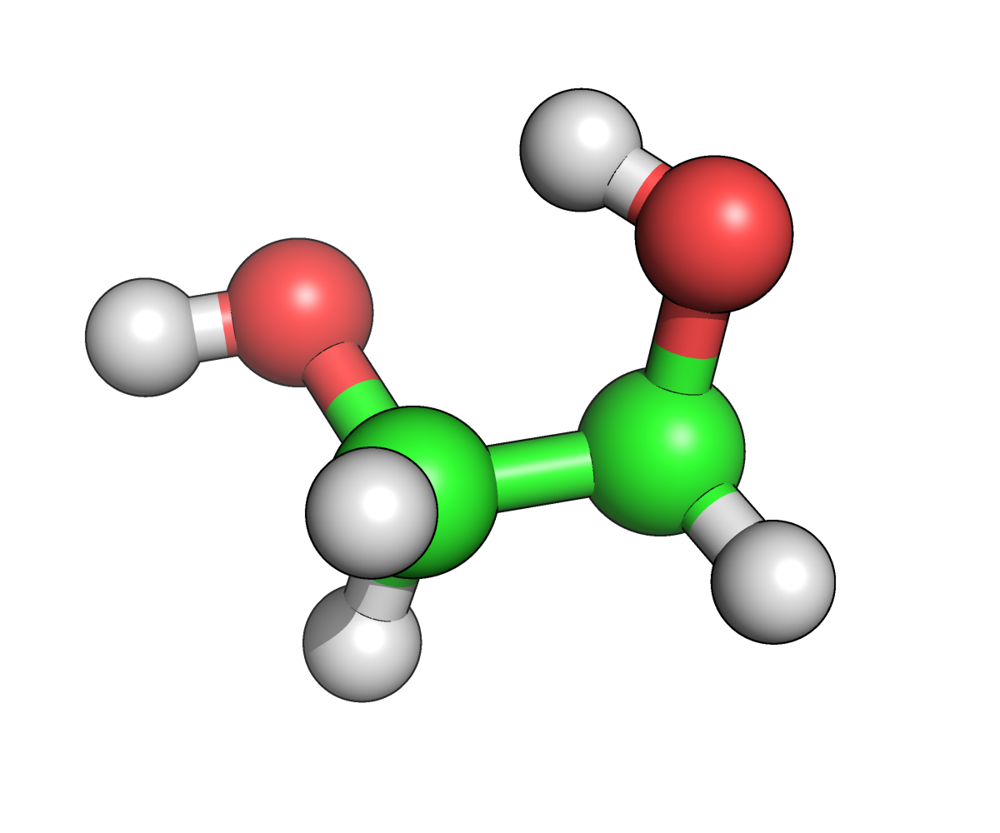

# MD simulations with OpenMM


OpenMM is a hardware independent molecular simulation library developed by Pande group at Stanford. OpenMM core libraries are written in C++ but a python wrapper is provided to make the interaction between user and library smoother. Please look at the below references for more information

-  [Instaling OpenMM](http://docs.openmm.org/7.0.0/userguide/application.html#installing-openmm)
-  [JCTC paper on implementation and capabilities](http://pubs.acs.org/doi/abs/10.1021/ct300857j) 
-  [Documentation](http://openmm.org/documentation.html) 

Please install OpenMM using from source code or using conda build if anaconda python is available in your computer. After successful installation continue to the do the tutorial below.

---
## 1,2-Ethane Diol system 

### Gas-phase minimization 

Upload the mol/pdb file of 1,2-Ethanediol or paste SMILES code from ChemDraw and download the **UNK.pdb** and **UNK.xml** files.

```python
import mdtraj as md
from simtk.openmm import app,KcalPerKJ
import simtk.openmm as mm
from simtk import unit as u
from sys import stdout,exit

temperature=298.15*u.kelvin
pdb = app.PDBFile('ETD.pdb')
modeller = app.Modeller(pdb.topology, pdb.positions)
forcefield = app.ForceField('ETD.xml')
system = forcefield.createSystem(modeller.topology, nonbondedMethod=app.NoCutoff,  constraints=None)

integrator = mm.LangevinIntegrator(temperature, 1/u.picosecond,  0.001*u.picoseconds)
simulation = app.Simulation(modeller.topology, system, integrator)
simulation.context.setPositions(modeller.positions)
simulation.minimizeEnergy(maxIterations=100)
energy=simulation.context.getState(getEnergy=True).getPotentialEnergy()
position = simulation.context.getState(getPositions=True).getPositions()
app.PDBFile.writeFile(simulation.topology, position, open('gasmin.pdb', 'w'))
print 'Energy at Minimized structure is %3.3f kcal/mol'%(energy._value*KcalPerKJ)

```

Save this code in `gasmin.py` and run it by typing following  command  

> python gasmin.py 
> 
> Energy at Minimized structure is 2.205 kcal/mol

### Gas-phase MD Simulation

If you want to do a gas phase MD simulation for 1 million steps of 1fs each, i.e a total of 1ns. Add the following lines to the code above and 